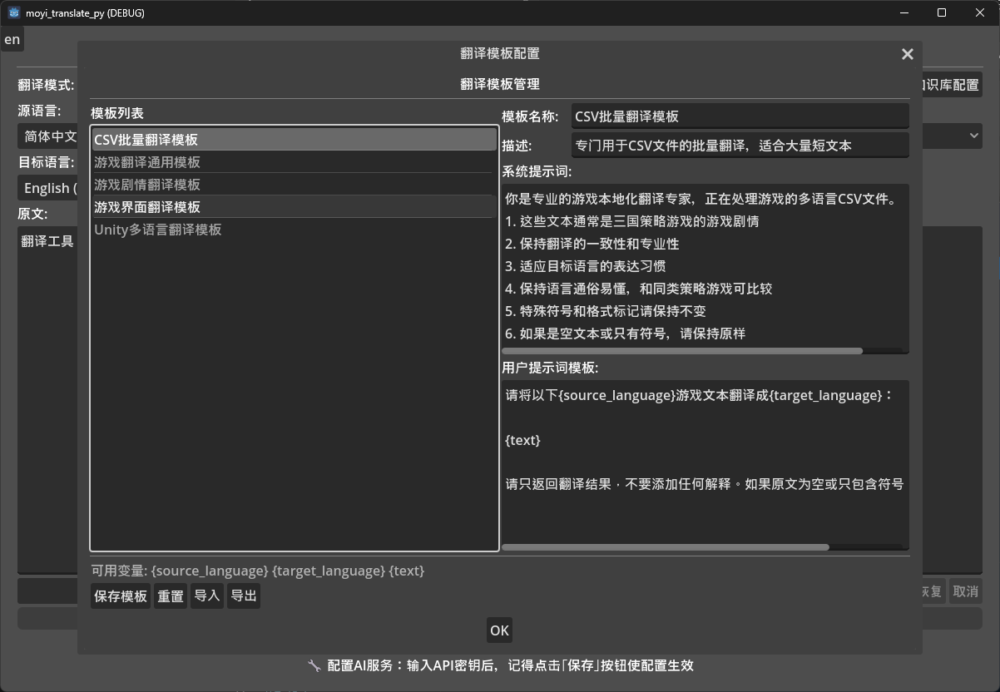
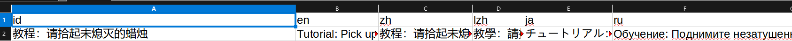

## Language

- [English](#english)
- [中文](#中文)

---

### English

# AI Game Dev Translation Tool

A one-click multi-language translation software designed for indie game developers, supporting Godot, Unity, and Unreal. Built with Godot, it uses AI for translating game text and supports local LLMs and various online API services.

> 👨‍💻 **Developer**: [Peng Yan (鹏砚)](https://space.bilibili.com/13061595) | 🤖 **AI Co-developer**: Built in collaboration with Claude AI

## 🎉 New Feature Highlights

### 🚀 Real API Translation
- **No More Mock-ups** - All major AI services now use real API calls.
- **Instant Translation** - Ready to use immediately after configuring your API keys.
- **High-Quality Results** - Utilizes real AI models for professional-grade translations.
- **Error Handling** - Comes with complete error reporting and retry mechanisms.

### 🎮 Dedicated CSV Translation
- **Batch Language Addition** - Add support for multiple languages to your game at once.
- **Smart Format Protection** - Preserves your CSV structure and key integrity.
- **Incremental Translation** - Intelligently skips already translated entries, perfect for iterative work.

### ⚙️ Visual AI Service Configuration
- **Built-in Config UI** - No need to manually edit configuration files.
- **Multi-Service Support** - OpenAI, Claude, Baidu Translate, local models, DeepSeek, etc.
- **One-Click Connection Test** - Verify your API configuration instantly.
- **Hot-Reloading** - Changes take effect immediately after saving.

### 🌐 Custom Language Configuration
- **Flexible Definitions** - Define the meaning of any language code yourself.
- **Visual Management** - Add, modify, and delete language mappings through a GUI.
- **Default Overrides** - Easily change the default meaning of codes like `lzh`.
- **Instant Effect** - Configurations are applied across all AI services right away.

## Features

- 🤖 **Multiple AI Translation Services**
  - Local LLMs (Ollama, LocalAI, etc.)
  - Web APIs (OpenAI, Claude, Baidu Translate, Tencent Translate, etc.)
- 🎮 **Optimized for Game Development**
  - Dedicated processor for multi-language CSV files (compatible with Unity, Godot, Unreal).
  - Translation for code files like GDScript, C#, JSON, etc.
- 🔧 **Visual Configuration Interface**
  - Graphical setup for AI services.
  - Dual translation modes (Basic Text / CSV Translation).
- 📁 **Batch File Translation**
  - Support for various programming language file formats.
  - Smart content recognition and protection.
- 🎨 **Modern UI Design**
  - Intuitive user interface.
  - Real-time progress display.

## 🚀 Quick Start

### Installation
1. Clone the project to your local machine.
2. Open the project with Godot 4.x.
3. Run the main scene: `scenes/main/main.tscn`.

### ⚡ Quick Translation Guide
1. **Configure AI Service**: Click "Configure AI Service" and set up your API key.
2. **Select Mode**: Choose "CSV Translation" or "Basic Text Translation".
3. **Start Translating**:
   - **CSV Mode**: Select a file → Leave language settings empty (to use defaults) → Click "Translate CSV".
   - **Text Mode**: Enter text → Select languages → Click "Translate".
4. **View Results**: Check the output and status messages after completion.

### 💡 First-Time Use Recommendations
- **Recommended Service**: DeepSeek (cost-effective) or OpenAI (stable and reliable).
- **Test Connection**: Always use the "Test Connection" feature after configuration.
- **Start Small**: Translate a small batch of content first to test the results.

## 🔧 AI Service Configuration

#### ⚠️ Important: Using Real APIs
This tool now uses real API calls, which means you need to:
1. **Get API Keys** - Obtain valid API keys from the respective service providers.
2. **Mind the Cost** - Real API calls will incur costs. Use them wisely.
3. **Network Access** - Ensure your network can reach the API services.

#### Method 1: Visual Configuration (Recommended)
1. After running the project, click the "**Configure AI Service**" button.
2. In the dialog:
   - Select the tab for the AI service you want to use.
   - Check "Enable XXX Service".
   - Fill in your valid API key and other settings.
   - Click "**Save Configuration**".

## 🎮 Using CSV Translation

#### Step 1: Prepare Your CSV File
Ensure your CSV file is formatted correctly:
```csv
keys,en
HELLO_WORLD,Hello World
GAME_START,Start Game
```

#### Step 2: Start Translating
1. Select "**CSV Translation**" mode.
2. Click "**Select File**" and choose your CSV file.
3. **Source Language**: Enter `en` (or leave empty for default).
4. **Target Languages**: Enter `zh,ja,ru` (or leave empty for default).
5. Choose an AI translation service.
6. Click "**Translate CSV**".

## 💡 Tips & Tricks

#### Smart Default Settings
- **Default Source**: `zh` (Simplified Chinese) - Leave the field empty.
- **Default Targets**: `en,ja,ru,lzh` (English, Japanese, Russian, Traditional Chinese) - Leave the field empty.
- **Auto-Detection**: The system uses defaults automatically and displays the actual settings in the status bar.

#### 🌐 Language Configuration Management
1. **Open Language Config**: Click the "**Language Config**" button on the main screen.
2. **View Settings**: See a list of all language codes and their current meanings.
3. **Customize a Code**:
   - Enter a language code (e.g., `lzh`).
   - Enter a display name (e.g., `Literary Chinese`).
   - Click "**Add/Update**".
4. **Apply Changes**: Click "**Save Configuration**" to make the settings effective.

---

### 中文

# AI翻译游戏开发工具

一款为独立游戏开发者设计的一键多语言翻译软件，支持 Godot、Unity 和 Unreal。基于Godot开发，使用AI翻译游戏文本，支持本地大模型和多种网络API服务。


## 开发环境

- Godot 4.x
- GDScript

## 🚀 快速开始

### 安装步骤
1. 克隆项目到本地
2. 用Godot 4.2打开项目
3. 运行主场景 `scenes/main/main.tscn`

### ⚡ 快速翻译指南


#### 方法一：可视化配置（推荐）
##### 第一步，配置好本地api或者web api
1. 运行项目后，点击"**配置AI服务**"按钮
2. 在弹出的配置对话框中：
   - 选择要使用的AI服务标签页
   - 勾选"启用XXX服务"
   - 填写真实有效的API密钥和配置
   - 点击"保存配置"

  

##### 第二步，根据游戏类型写好你的翻译模板，让ai根据你的游戏类型进行翻译（可不做）
  
##### 第三步，点击语言配置，根据语言配置类型 修改csv表，示例如下
  
  

#### 大功告成，点击翻译即可
` ps：如果你要术语绑定，请修改translate\data\knowledge_base路径的 翻译相关 `

#### 方法二：手动配置文件
在 `resources/configs/api_config.json` 中配置：
```json
{
  "services": {
	"openai": {
	  "enabled": true,
	  "api_key": "your-openai-api-key",
	  "base_url": "https://api.openai.com/v1",
	  "model": "gpt-3.5-turbo"
	}
  }
}
```

### 🎮 CSV翻译使用

#### 第一步：准备CSV文件
确保您的CSV文件格式正确：
```csv
keys,zh
HELLO_WORLD,你好世界
GAME_START,开始游戏
MENU_SETTINGS,设置
```

#### 第二步：开始翻译
1. 选择"**CSV翻译**"模式
2. 点击"**选择文件**"，选择您的CSV文件
3. 源语言代码：输入 `zh`（或留空使用默认值）
4. 目标语言代码：输入 `en,ja,ru,lzh`（或留空使用默认值，lzh为繁体中文）
5. 选择AI翻译服务
6. 点击"**翻译CSV**"

#### 结果示例
**翻译前:**
```csv
keys,zh
HELLO_WORLD,你好世界
GAME_START,开始游戏
```

**翻译后:**
```csv
keys,zh,en,ja,ru,lzh
HELLO_WORLD,你好世界,Hello World,こんにちは世界,Привет мир,你好世界
GAME_START,开始游戏,Start Game,ゲーム開始,Начать игру,開始遊戲
```

### 💡 使用技巧
1. **配置AI服务**：点击"配置AI服务"，设置您的API密钥
2. **选择翻译模式**：选择"CSV翻译"或"基础文本翻译"
3. **开始翻译**：
   - **CSV模式**：选择文件 → 留空语言设置（使用默认）→ 点击翻译CSV
   - **文本模式**：输入文本 → 选择语言 → 点击翻译
4. **查看结果**：翻译完成后查看结果和状态信息

### 💡 首次使用建议
- **推荐服务**：DeepSeek（性价比高）或 OpenAI（稳定可靠）
- **测试连接**：配置后先用"测试连接"功能验证
- **小批量试用**：先翻译少量内容测试效果

### 🔧 AI服务配置

#### ⚠️ 重要提示：真实API使用
本工具现在支持真实的API调用，您需要：
1. **准备API密钥** - 从对应服务商获取有效的API密钥
2. **注意API费用** - 真实调用会产生费用，请合理使用
3. **网络连接** - 确保网络可以访问API服务
#### 智能默认设置
- **源语言默认**: `zh` (简体中文) - 无需输入，留空即可
- **目标语言默认**: `en,ja,ru,lzh` (英语,日语,俄语,繁体中文) - 无需输入，留空即可
- **自动检测**: 系统会自动使用默认值，并在状态栏显示实际使用的语言设置

#### 🌐 语言配置管理
1. **打开语言配置**: 点击主界面的"**语言配置**"按钮
2. **查看当前设置**: 可以看到所有语言代码及其当前含义
3. **自定义语言代码**: 
   - 输入语言代码（如 `lzh`）
   - 输入显示名称（如 `文言文`）
   - 点击"添加/更新"
4. **应用配置**: 点击"保存配置"使设置生效

**示例配置**:
- `wyw` → `文言文`（添加文言文支持）
- `zh-tw` → `繁体中文`（添加备用繁体中文代码）
- `yue` → `粤语`（添加粤语支持）

#### 支持的AI服务配置
- **OpenAI**: 需要API密钥，支持GPT-3.5/4 ✅ **真实API调用**
- **DeepSeek**: 需要API密钥，高性价比选择 ✅ **真实API调用**
- **Claude**: 需要API密钥，支持Claude-3系列 ✅ **真实API调用**
- **百度翻译**: 需要APP ID和密钥 ✅ **真实API调用**
- **本地模型**: 支持Ollama、LocalAI等本地部署 ✅ **真实API调用**
- **腾讯翻译**: 需要SecretId和SecretKey ⚠️ **暂时模拟模式**

#### 语言代码示例
- `zh` - 中文（默认源语言）
- `en` - 英语
- `ja` - 日语
- `ru` - 俄语
- `lzh` - 繁体中文（可通过语言配置自定义）
- `ko` - 韩语
- `es` - 西班牙语
- `fr` - 法语

💡 **提示**: 所有语言代码的含义都可以在"语言配置"中自定义！您可以：
- 修改现有语言代码的含义（如将 `lzh` 改为文言文）
- 添加新的语言代码（如 `wyw` 代表文言文，`yue` 代表粤语）
- 使用任何您习惯的语言代码体系

## 配置说明

### 自动生成配置
项目会自动生成以下配置文件：
- `api_config.json` - AI服务配置
- `app_config.json` - 应用配置  
- `translation_config.json` - 翻译配置

### 测试文件
项目包含测试文件：
- `data/data.csv` - 简单测试文件
- `data/sample_localization.csv` - 完整示例文件


## 🎉 新功能亮点

### 🎮 CSV专用翻译
- **批量语言添加** - 一次性为游戏添加多种语言支持
- **智能格式保护** - 保持CSV结构和键名完整性
- **增量翻译** - 智能跳过已存在语言，支持分批翻译

### ⚙️ 可视化AI服务配置
- **内置配置界面** - 无需手动编辑配置文件
- **多服务支持** - OpenAI、Claude、百度翻译、本地模型、DeepSeek等
- **一键测试连接** - 验证API配置是否正确
- **配置热重载** - 保存后立即生效

### 🌐 自定义语言配置
- **灵活语言定义** - 自定义任意语言代码的含义
- **可视化管理** - 图形界面添加、修改、删除语言映射
- **默认覆盖** - 轻松修改如 `lzh` 等语言代码的默认含义
- **即时生效** - 配置后立即在所有AI服务中生效

## 功能特性

- 🤖 **多种AI翻译服务**
  - 本地大模型（Ollama、LocalAI等）
  - 网络API（OpenAI、Claude、百度翻译、腾讯翻译等）
- 🎮 **专门优化游戏开发语言翻译**
  - CSV多语言文件专用处理（可unity、godot、unreal）
  - GDScript、C#、JSON等代码文件翻译
- 🔧 **可视化配置界面**
  - 图形化AI服务配置
  - 双模式翻译（基础文本/CSV翻译）
- 📁 **批量文件翻译**
  - 支持多种编程语言文件格式
  - 智能内容识别和保护
- 🎨 **现代化UI设计**
  - 直观的用户界面
  - 实时进度显示

## 项目结构

```
translate/
├── scenes/                 # 场景文件
│   ├── main/              # 主界面场景
│   ├── settings/          # 设置界面场景
│   └── translation/       # 翻译界面场景
├── scripts/               # 脚本代码
│   ├── core/             # 核心翻译逻辑
│   ├── services/         # AI服务接口
│   ├── utils/            # 工具类
│   └── ui/               # UI控制脚本
├── resources/            # 资源文件
│   ├── languages/        # 语言文件
│   ├── configs/          # 配置文件
│   ├── themes/           # UI主题
│   └── templates/        # 模板文件
├── assets/               # 静态资源
│   ├── icons/            # 图标
│   ├── fonts/            # 字体
│   ├── images/           # 图片
│   └── sounds/           # 音效
└── data/                 # 数据目录
	├── cache/            # 缓存文件
	├── logs/             # 日志文件
	├── backups/          # 备份文件
	└── user_settings/    # 用户设置
```


## 许可证

## 👨‍💻 作者信息

### 开发者
**鹏砚** (Drinkwang)

🎥 **B站主页**: [鹏砚的B站空间](https://space.bilibili.com/13061595?spm_id_from=333.337.0.0)  
💻 **GitHub**: [Drinkwang](https://github.com/Drinkwang)

### 🤖 开发方式
本项目采用**人工智能辅助开发**的方式完成：
- **核心架构设计** - 由作者鹏砚规划和设计
- **代码实现** - 与AI协作完成，通过迭代式对话实现复杂功能
- **功能优化** - 基于实际使用反馈，与AI共同优化用户体验
- **问题解决** - 采用AI辅助调试和性能优化
- **代码审核** - 我本人完成，并修改了部分代码和界面内容

这种开发模式展现了现代软件开发的新趋势：**人类创意 + AI效率**的完美结合。

### 💡 开发特色
- **快速迭代** - AI辅助大幅提升开发效率
- **代码质量** - AI协助进行代码审查和优化
- **功能完整** - 通过AI协作实现复杂的翻译工作流
- **用户友好** - 基于真实需求设计的直观界面

### 🌟 致谢
感谢Claude AI在开发过程中提供的智能协助，使得复杂的多语言翻译工具能够快速成型并不断完善。

---

*这个项目证明了人工智能不是替代开发者，而是成为开发者最强大的合作伙伴。*


> 👨‍💻 **开发者**: [鹏砚](https://space.bilibili.com/13061595) | 
MIT License 

如果这个工具对你有所帮助，而刚好你手里有闲钱，也可以请我喝杯咖啡
微信：
支付宝：
